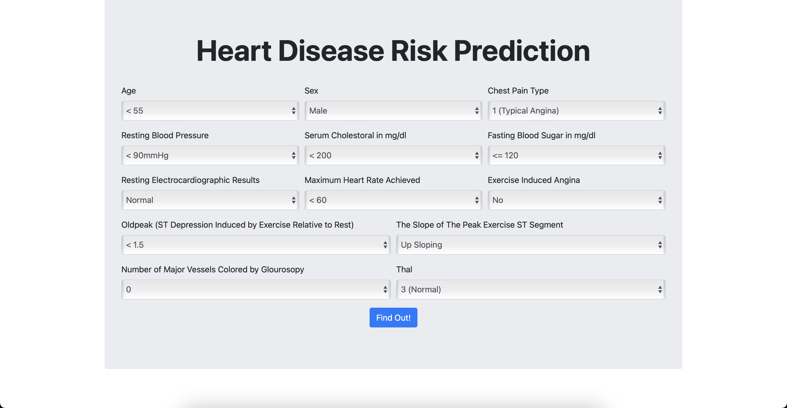

# Data Science Project

## 👀 The Preview

## 👩🏻‍💼 Intro
This project is built for my Data Mining Class I took.

## 📈 Data
The data I used is from (Kaggle Heart Disease Dataset) [https://www.kaggle.com/datasets/johnsmith88/heart-disease-dataset] but i think with the current development, this dataset is already altered into the new ones. 

## 🛠️ Process
Now after those data collected, surely it will going through data cleaning. Also, I used feature selection before I put it into Machine Learning. As for Machine Learning, I try two models, the first oone is [Kmeans Clustering] (https://towardsdatascience.com/understanding-k-means-clustering-in-machine-learning-6a6e67336aa1) and [K-Nearest Neighbor] (https://towardsdatascience.com/machine-learning-basics-with-the-k-nearest-neighbors-algorithm-6a6e71d01761). After several iteration and analysis, Kmeans model has higher learning score so I used Kmeans for my model.
